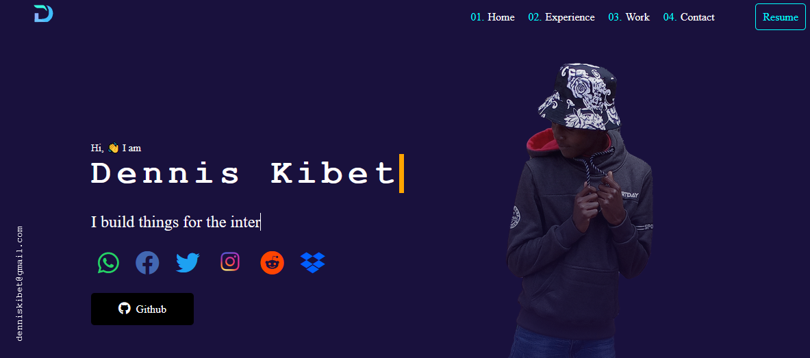

<h1>Hey, 👋 Iam Dennis Rono</h1>

I am a full-stack developer who enjoy writing computer programs ✌

<!--  -->

<a href="https://denniskibet.com/">
  &nbsp;
 <!-- wi*quL3fcV -->
  </a>

<!--  -->

<!-- <h2>About Me</h2>
<h4>Developer & Designer</h4>

My interest in computer programming started back in High School when I decided to do a science fair project on web development. As simple as my science fair project was, it taught me a lot about HTML & CSS.

  I've had the privilege of participating in Kenya Robotics competitions for high schools. Fast forward to today, where I am currently a student at Machakos University where I am studying for a degree in computer science.

  Currently, my main focus is finding reliable solutions for software issues. I am fluent in English and accustomed to working with cross-cultural, global terms.

Iam currently a student at Machakos university studying Computer science.
 -->
<h2>🚀 Some Tools I Use</h2>

  
<!--  

  -->
 
 ## contact me:
 

 

</a> 

  

